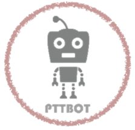
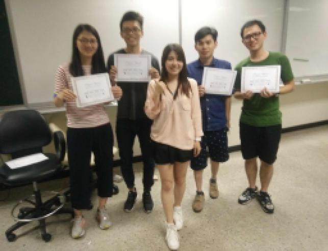
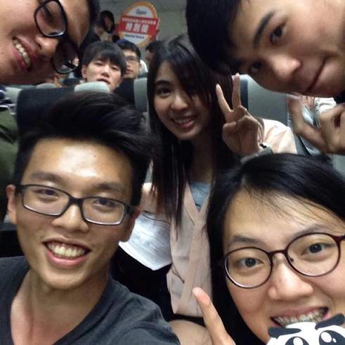

# PTTBot

* [Prerequisites](#prerequisites)
* [Usage](#usage)

<<<<<<< HEAD
=======

>>>>>>> 585b1ba31c521cb598ac3269ed6a058fbb946ff2


## Prerequisites
### Download
Please download packages by executing download.sh before running the code:
```bash
  bash download.sh
```

### Python Requirements
The python version is Python 2.7.
(Maually Install)-The required library is listed below 
```bash
Flask==0.12.2
gym==0.10.5
h5py==2.7.1
keras-rl
tensorflow==1.0.0
keras>=2.0.2
h5py>=2.6.0
pandas>=0.13.1
apiai
```
(Automatically Install)
```bash
pip install -r requirements.txt
```

### Config
Change Keras configuration.
`image_data_format` and `backend` in `~/.keras/keras.json`
```
{
    "epsilon": 1e-07,
    "floatx": "float32",
    "image_data_format": "channels_last",
    "backend": "theano"
}
```

## Usage
### Run the server
```bash
  python server.py
```

### Web Interface
To test the chatbot, open the browser and type in http://localhost:5000 [link](http://localhost:5000)


## Authors
| [<br /><sub><b>Chung Kai Hsieh</b></sub>](https://github.com/account)<br />        | [<br /><sub><b>HungWei-Andy</b></sub>](https://github.com/HungWei-Andy)<br />  | [<br /><sub><b>ChaohuiYu</b></sub>](https://github.com/ChaohuiYu)<br />          | [<br /><sub><b>Zheng Pei Chun</b></sub>](https://www.facebook.com/rubbincheng?ref=br_rs)<br /> 
|:---:|:---:|:---:|:---:|
## Reward
2017 Chatbot Competition : Emotibot Reward
<p align="left">
    
</p>


